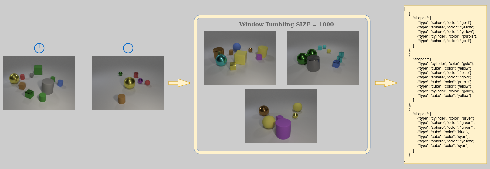

# Image processing with LLM
This branch contains a (naive) implementation of a Stream Processor engine
using the [Polyflow](https://github.com/riccardotommasini/polyflow) APIs.

The system:
- Consumes images from an input stream (generated from the [resources](src/main/resources) folder)
- Encodes them in Base64 string format
- Sends them to a remote LLM (GPT 4o mini, but can be changed) for processing using [LangChain4j](https://github.com/langchain4j/langchain4j)
- Streams out the answer.

Two examples have been developed:
- [Scene Graph answers](src/main/java/LLM/example_scenegraph.java), in which the LLM is asked to return a scene graph
  of the processed images in JSON format, which is then parsed and streamed out object by object
- [Natural Language answers](src/main/java/LLM/example_natural.java), in which the LLM is asked a query in natural language
  (e.g. "How many cylinders in the pictures?") and the answer is streamed out as a single string.

Although further processing would be inconvenient for the natural language answer,
it is entirely possible to add additional processing on the scene graphs answers by defining
more [Relation to Relation operators](https://github.com/riccardotommasini/polyflow/blob/master/api/src/main/java/org/streamreasoning/rsp4j/api/operators/r2r/RelationToRelationOperator.java)
similar to the one defined [here](src/main/java/LLM/customoperators/LLMOperator_scenegraph.java),
overriding the `eval` method with operations to process JSON objects.

To use a different LLM, change the constructor in the [natural](src/main/java/LLM/customoperators/LLMOperator_natural.java) and
[scene graph](src/main/java/LLM/customoperators/LLMOperator_scenegraph.java) operators.\
In order to make the example work, please add your OpenAI key to an environment variable
with name `OPENAI_KEY` (or paste it directly as a String in the `apiKey` method in the constructor).

To understand how the system works and be able to extend the examples further, we suggest
to read the [Official Documentation](https://github.com/riccardotommasini/polyflow/blob/master/rsp4j-documentation.md)
and follow the [step-by-step guide](https://github.com/FerriAlessandro/rsp4j-quickstart/blob/master/quickstart/step-by-step-guide.md) in the
[quickstart repo](https://github.com/FerriAlessandro/rsp4j-quickstart)

